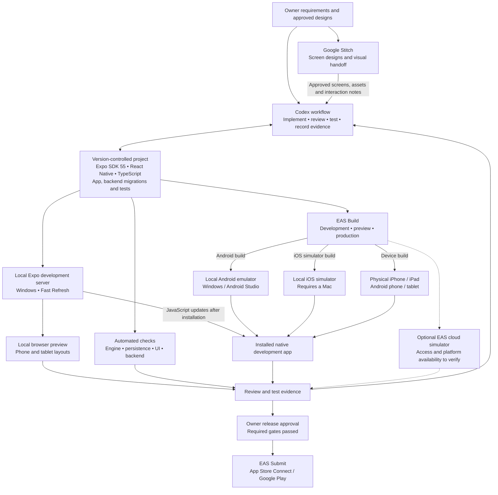
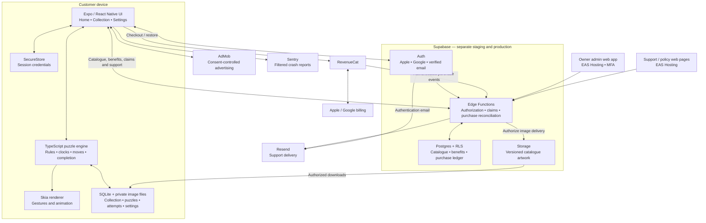
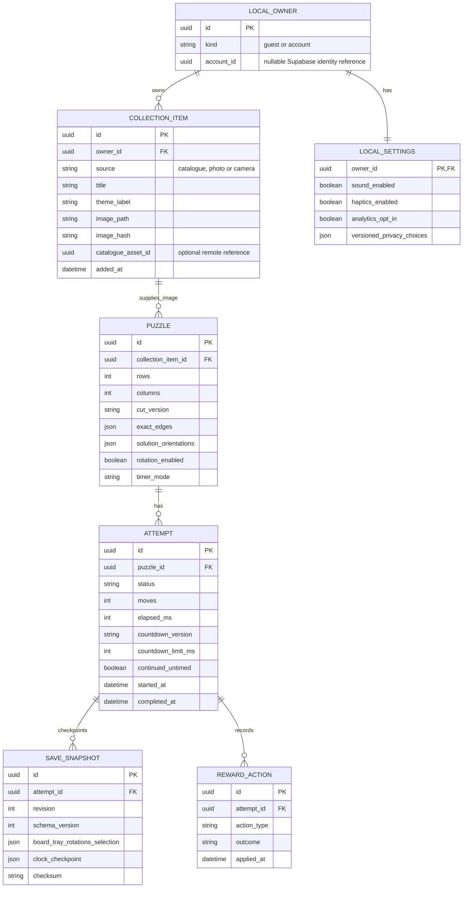
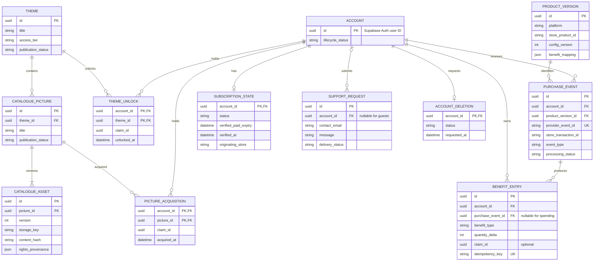

# V1 visual and entity architecture

Date: 5 October 2026. Status: proposed logical architecture, saved from the architecture review in chat. This document does not claim implemented integrations, deployed schemas or completed native tests.

Authority: latest explicit owner decisions, then the [production plan](production-v1-plan.md), [requirements register](requirements-register.md) and [security requirements](security-requirements.md). See [readiness](readiness.md) for unresolved setup and acceptance gates. This document explains those requirements; it does not supersede them.

Gameplay and personal images live on the device. Accounts, catalogue access and verified purchase benefits live in Supabase. Mermaid code blocks below remain editable and render in Mermaid-compatible Markdown viewers, including GitHub.

## 1. Visual architecture: development and testing

Google Stitch supplies the design handoff. Codex translates approved designs into maintainable React Native components. Exported frontend code is reference material requiring review. Preserve imported asset bytes; create production derivatives separately. See [Google Stitch overview](https://developers.googleblog.com/en/stitch-a-new-way-to-design-uis/).

| Route | Purpose |
|---|---|
| Windows browser preview | Daily layout and gameplay iteration using `npx expo start --web`; no EAS build required. This is not an OS emulator. |
| Local Android emulator | Android native development and integration checks. |
| Local iOS simulator | iOS native checks on macOS; it cannot run locally on Windows. |
| EAS cloud simulator | Optional remote testing. Early access at review time; project access and Android availability remain unverified. |
| Physical devices | Required evidence for performance, camera, permissions, purchases, ads and lifecycle interruptions. |

EAS Build creates binaries; a simulator or device runs them. Compatible JavaScript changes can use the development server; native dependency/configuration changes require rebuilding. Development adapters must be clearly labelled and excluded from production. No fabricated purchases or entitlements.

References checked during the architecture review: [EAS builds](https://docs.expo.dev/build/setup/), [iOS simulator requirements](https://docs.expo.dev/workflow/ios-simulator/), [EAS Simulator](https://expo.dev/services/simulators). Provider availability can change and must be verified at setup.

## 2. Visual architecture: the running product

Every puzzle move runs locally. Supabase authorizes shared account benefits; store verification through RevenueCat establishes purchase validity. Personal photos and exact puzzle progress have no cloud upload or sync path in v1. Optional analytics uses a small allowlisted Supabase pipeline only after consent. Guest free-catalogue browsing and support remain available without sign-in, with validation and abuse limits.

## 3. Entity architecture: local gameplay data

This is a minimum logical model, not a finalized SQL migration. PK means primary key; FK means a relationship within the same database. Remote identity and catalogue references in local storage are not cross-database foreign keys.

- Collection item means one reusable picture; puzzle means one Home entry; attempt means one playthrough.
- Create Puzzle creates a new puzzle. Restart/Play Again creates a new attempt under the existing puzzle, preserving its cut and settings.
- Exact piece shapes belong to the puzzle; positions and rotations belong to saved attempt state. Separate database rows for every piece are unnecessary.
- Keep current and last-known-good snapshots with atomic saves and bounded schema validation. Attempt statistics and snapshots must remain transactionally consistent.
- Derive Times Used from started attempts and Last Used from attempt activity; resuming does not increment Times Used.
- Collection deletion removes dependent puzzles after count-confirmation. Home deletion preserves the collection picture.
- Guest content moves into an account scope only after explicit consent. Sign-out hides retained account content and restores the separate guest scope.
- Reward actions need unique operation IDs and once-only application with the gameplay mutation. Completion or approved no-fill/technical failure grants the action; cancellation grants nothing.
- Countdown duration and table version are captured per attempt. Both clocks pause during background, Home, ads and forced connectivity pauses. Untimed continuation cannot become timed success.

## 4. Entity architecture: Supabase data

The purchase-event relationship shows purchase-backed benefit entries; spending entries may have no purchase-event reference. Claim IDs correlate allowance spending, theme unlocks and picture acquisitions within one transaction. Published pictures require a valid immutable asset version; draft creation can be staged before publication.

| Rule | Implementation boundary |
|---|---|
| Acquire each picture once per account | Unique `(account_id, picture_id)`; redownload does not spend again. |
| Unlock each theme once | Unique `(account_id, theme_id)`. |
| First picture from a locked premium theme | Confirm and atomically debit theme/picture allowances, unlock the theme and acquire the picture. |
| Prevent duplicate purchase grants | Deduplicate provider events and transaction-level benefit grants. |
| Show allowance used/granted | Derive from the server ledger; clients cannot edit balances. |
| Separate subscription from packs | Subscription provides ad removal and offline access; it grants no premium picture allowance. |
| Preserve existing puzzles | Pin downloaded image versions; replacement artwork does not alter existing puzzles. |
| Preserve privacy | Account-scoped RLS, backend authorization, privileged writes through functions and no provider secrets in the app. |

Owner administration also needs an audit log with actor, action, target and timestamp. Support requests are stored before email delivery, with duplicate protection and retry/failure handling.

The device needs an account-bound cache of verified subscription expiry for offline access; it is not purchase authority. Product prices and quantities require owner approval. Refund/revocation handling for spent allowances, deletion retention and reconnect cleanup require reviewed policies before implementation. The account-deletion entity is a lifecycle concept, not a decision to retain personal identity indefinitely; final schema and cleanup must support deletion without orphaned records.

## Scope and evidence

AI generation, multiplayer, leaderboards, cloud image/progress sync and manual backup are outside v1. SDK 55 and the requested iOS 15.1+/Android 7+ targets remain subject to native compatibility evidence; no silent OS-floor increase is authorized.

These diagrams have been checked against the active project requirements. They are documentation, not native performance, integration, security or release acceptance evidence. No deployment or service provisioning is performed by saving this document.
